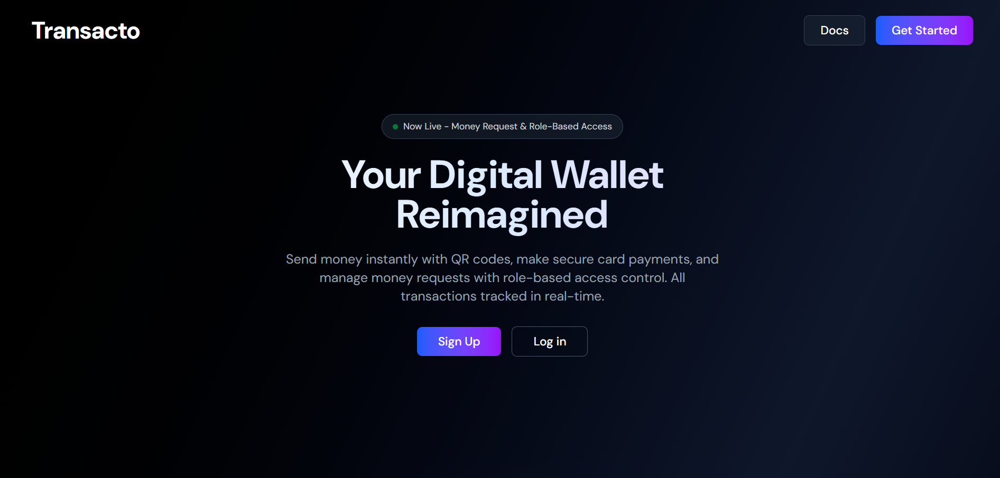
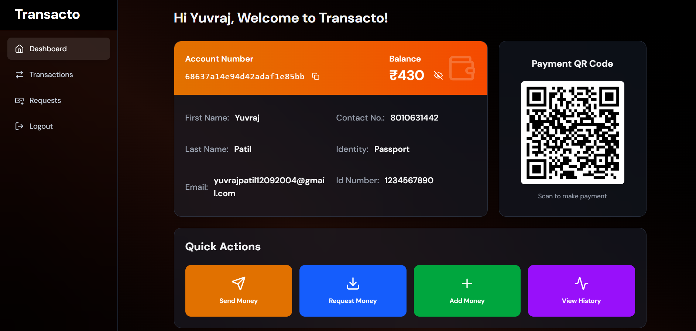
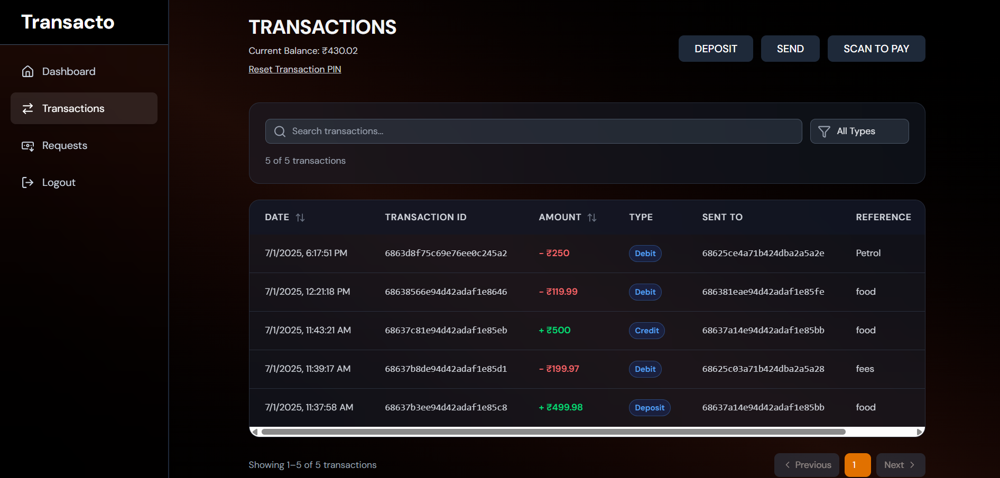
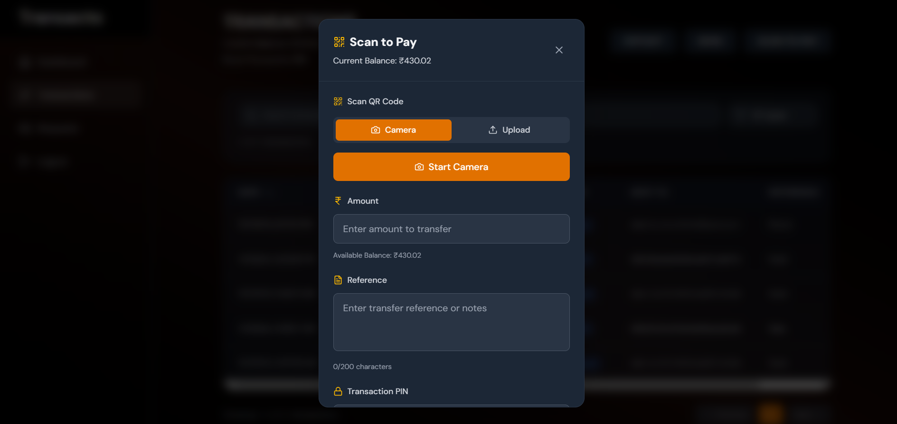
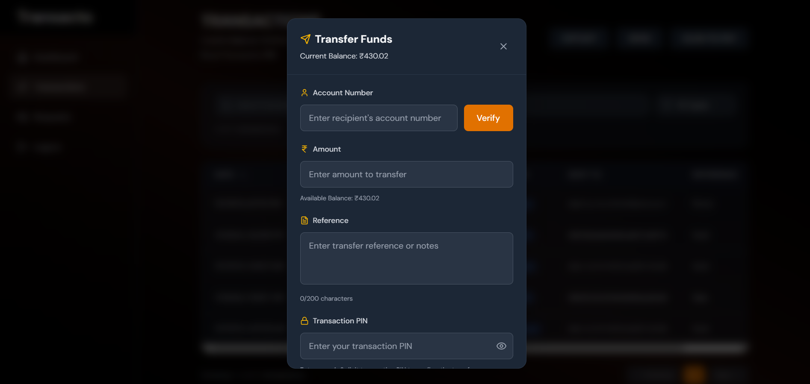
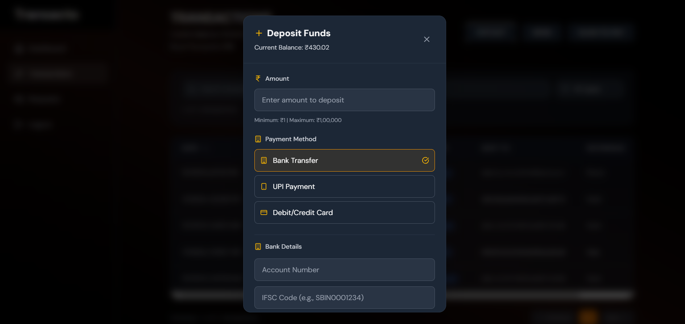
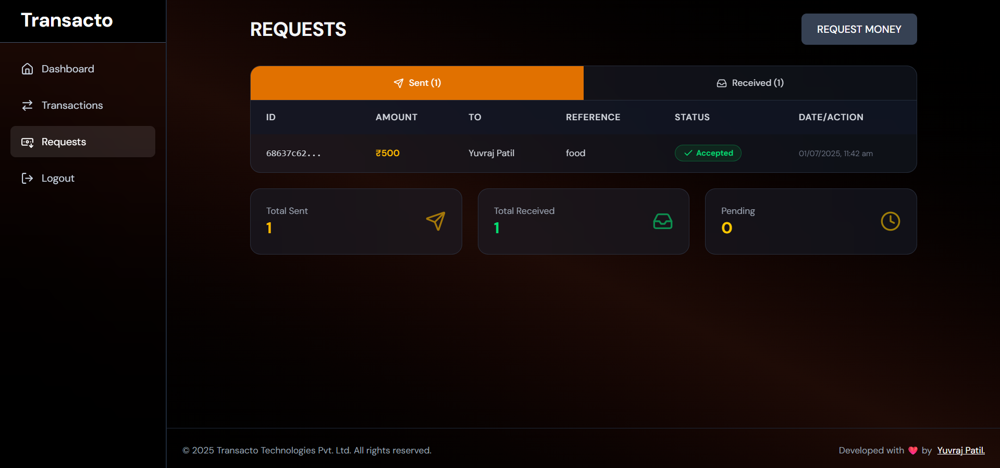

# Transacto - Digital Wallet & Payment Platform

A comprehensive digital wallet and payment platform built using the MERN stack, demonstrating modern web development practices with a focus on security and user experience in financial applications.

**[Live Link](https://transacto.onrender.com/)**

## Table of Contents

- [Overview](#overview)
- [Features](#features)
- [Tech Stack](#tech-stack)
- [Screenshots](#screenshots)
- [Installation](#installation)
- [Usage](#usage)
- [Security Features](#security-features)
- [API Documentation](#api-documentation)

## Overview

Transacto is a full-stack digital wallet application that provides secure financial transactions with modern web technologies. The platform implements role-based access control, multiple payment methods, and comprehensive transaction management with enterprise-level security features.

## Features

### Authentication & Authorization

- **Role-Based Access Control (RBAC)**: Admin verification system for user access
- **Multi-factor Authentication**: JWT & Passport.js with Google OAuth
- **Secure Password Management**: bcryptjs hashing with salt rounds

### Payment Processing

- **Scan to Pay**: QR code generation and scanning for instant payments
- **Deposit Funds**: Multiple payment methods via Stripe integration (UPI, bank transfers, cards)
- **Send Money**: Direct transfers using account numbers with PIN verification

### Transaction Management

- Complete transaction history with advanced filtering
- Search and sort functionality
- Real-time transaction status tracking
- Secure PIN reset functionality

### Money Requests

- Send money requests using account numbers
- Separate views for sent and received requests
- Approve/reject incoming requests
- Request status notifications

## Tech Stack

### Frontend Technologies

- **React 19** - Latest React version with concurrent features
- **Redux Toolkit** - State management with RTK Query
- **Tailwind CSS** - Utility-first CSS framework
- **Framer Motion** - Animation library for smooth UX
- **Stripe React Components** - Secure payment processing
- **React Router DOM** - Client-side routing
- **Axios** - HTTP client for API communication
- **QRcodejs** - QR code generation and scanning

### Backend Technologies

- **Node.js** - Runtime environment
- **Express.js** - Web application framework
- **MongoDB** - NoSQL database
- **Mongoose** - MongoDB object modeling
- **Redis** - Caching and session management
- **Stripe API** - Payment processing
- **JWT & Passport.js** - Authentication middleware
- **Nodemailer** - Email service integration

### Security Implementation

- **Helmet.js** - Security headers middleware
- **Express Rate Limit** - API rate limiting
- **XSS Clean** - Cross-site scripting protection
- **Express Mongo Sanitize** - NoSQL injection prevention
- **HPP** - HTTP parameter pollution protection

## Screenshots

### Landing Page


_Modern landing page with hero section, feature highlights, and call-to-action for user registration_

### Dashboard Overview


_Clean, intuitive dashboard displaying account balance, recent transactions, and quick access to core features_

### Transaction Management


_Comprehensive transaction history with advanced filtering, search functionality, and detailed transaction records_

### Core Payment Features

#### Scan to Pay


_QR code generation and scanning interface for instant peer-to-peer payments with real-time validation_

#### Transfer Funds


_Direct money transfer interface with account number input, amount selection, and secure PIN verification_

#### Deposit Funds


_Multiple deposit options powered by Stripe integration supporting UPI, bank transfers, and credit/debit cards_

### 💰 Money Request System


_Comprehensive request management system with separate views for sent/received requests and approval workflows_

---

### UI/UX Highlights

- **Modern Design**: Clean, responsive interface built with Tailwind CSS
- **Smooth Animations**: Framer Motion integration for enhanced user experience
- **Mobile-First**: Fully responsive design optimized for all device sizes
- **Accessibility**: WCAG compliant with proper contrast ratios and keyboard navigation
- **Real-Time Updates**: Live transaction status and balance updates
- **Security-First**: Visual security indicators and secure form handling

## Installation

### Prerequisites

- Node.js (v18 or higher)
- MongoDB (v5.0 or higher)
- Redis (v6.0 or higher)
- Stripe Account (for payment processing)

### Clone the Repository

```bash
git clone https://github.com/yourusername/transacto.git
cd transacto
```

### Backend Setup

```bash
cd backend
npm install

# Create environment file
cp .env.example .env

# Configure environment variables
# DATABASE_URL=mongodb://localhost:27017/transacto
# REDIS_URL=redis://localhost:6379
# JWT_SECRET=your_jwt_secret
# STRIPE_SECRET_KEY=your_stripe_secret_key
# GOOGLE_CLIENT_ID=your_google_client_id
# GOOGLE_CLIENT_SECRET=your_google_client_secret

# Start the backend server
npm run dev
```

### Frontend Setup

```bash
cd frontend
npm install

# Create environment file
cp .env.example .env

# Configure environment variables
# REACT_APP_API_URL=http://localhost:5000/api
# REACT_APP_STRIPE_PUBLISHABLE_KEY=your_stripe_publishable_key

# Start the frontend development server
npm start
```

## Usage

### User Registration & Verification

1. Register with email and password or use Google OAuth
2. Complete profile information
3. Wait for admin verification to access transaction features

### Making Transactions

1. **Send Money**: Enter recipient's account number and amount
2. **Scan to Pay**: Generate or scan QR codes for instant payments
3. **Deposit Funds**: Use Stripe integration for multiple payment methods

### Managing Requests

1. Send money requests to other users
2. View and manage sent/received requests
3. Approve or reject incoming requests

## Security Features

### Authentication Security

- JWT tokens with secure HTTP-only cookies
- Password hashing with bcryptjs and salt rounds
- Google OAuth integration for secure login

### Transaction Security

- Transaction PIN verification for all transfers
- Real-time fraud detection and prevention
- Secure webhook handling for payment confirmations

### Application Security

- Helmet.js for security headers
- Rate limiting to prevent brute force attacks
- XSS protection and input sanitization
- NoSQL injection prevention
- HTTP parameter pollution protection

## API Documentation

### Authentication Endpoints

```
POST /api/auth/register - User registration
POST /api/auth/login - User login
POST /api/auth/google - Google OAuth
POST /api/auth/logout - User logout
```

### Transaction Endpoints

```
POST /api/transactions/send - Send money
POST /api/transactions/deposit - Deposit funds
GET /api/transactions/history - Transaction history
POST /api/transactions/qr-generate - Generate QR code
POST /api/transactions/qr-pay - Process QR payment
```

### Request Endpoints

```
POST /api/requests/send - Send money request
GET /api/requests/received - Get received requests
GET /api/requests/sent - Get sent requests
PUT /api/requests/:id/approve - Approve request
PUT /api/requests/:id/reject - Reject request
```

## Contributing

We welcome contributions! Please follow these steps:

1. Fork the repository
2. Create a feature branch (`git checkout -b feature/amazing-feature`)
3. Commit your changes (`git commit -m 'Add amazing feature'`)
4. Push to the branch (`git push origin feature/amazing-feature`)
5. Open a Pull Request

### Development Guidelines

- Follow ESLint and Prettier configurations
- Write comprehensive tests for new features
- Update documentation for any API changes
- Ensure security best practices are followed

## Key Learnings

This project enhanced understanding of:

- Building secure financial applications with industry standards
- Payment gateway integration and webhook handling
- Advanced authentication and authorization patterns
- Redis caching for improved performance
- Modern React patterns with Redux Toolkit
- Security best practices for web applications

## 💡 Acknowledgments

- Stripe for secure payment processing
- MongoDB for reliable data storage
- Redis for efficient caching solutions
- The open-source community for valuable libraries

---

**Built with ❤️ by Yuvraj Patil**

For questions or support, please reach out via [email](mailto:yuvrajpatil12092004@gmail.com) or [LinkedIn](https://linkedin.com/in/yuvrajkpatil).
